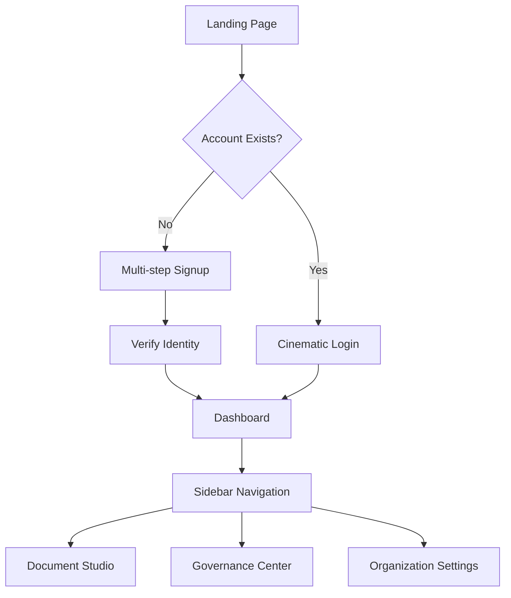

# Project Architect Analyst: Alonix SaaS Platform

## 1. Project Overview (Business Perspective)
Alonix is an Enterprise-grade Identity Provider (IDP) and Document Intelligence platform designed for the "Digital Curator." It solves the problem of fragmented documentation, PII (Personally Identifiable Information) risk, and manual document categorization by providing an AI-driven, secure, and multi-tenant environment for processing sensitive information.

**Value Proposition:**
- **Security First:** Built-in PII redaction and role-based access control (RBAC).
- **Intelligence at Scale:** Leverages advanced OCR and semantic understanding to transform document chaos into structured data.
- **SaaS Readiness:** Designed to support multiple enterprise clients with strict data isolation and consumption-based pricing.

---

## 2. Feature Breakdown (Module-wise)

### 2.1 Authentication & Identity Management
- **Cinematic Auth Suite:** High-fidelity, split-pane UI for Login, Signup, Verification, and Password Recovery.
- **Organization Onboarding:** Multi-step signup flow including organization/company name collection.
- **Session Security:** Persistent JWT-based authentication with auto-logout on token expiration.

### 2.2 Dashboard & Sidebar
- **Dynamic Real-time Interface:** Minimizable sidebar with dual-branding (Full Logo vs. Favicon) based on state.
- **Context-Aware Navigation:** Sidebar links adapt based on user roles and active group context.

### 2.3 SaaS Landing & Conversion
- **Atmospheric Hero:** Motion-driven introduction with "Digital Curator" branding.
- **Interactive Pricing Engine:** 3-tier SaaS pricing model (Lite, Premium, Enterprise) with a state-driven Billing Cycle Toggle (Monthly/Yearly) and automatic discount calculations.
- **Feature Showcase:** Bento-grid layout for technical capabilities like OCR Engine Pro and Auto-Curator.

---

## 3. User Flows / Use Cases

### 3.1 Enterprise Onboarding (SaaS Flow)
1. **Discovery:** User lands on `LandingPage`, reviews "Intelligence" and "Pricing".
2. **Selection:** Choose a plan (e.g., Premium Yearly) via the interactive toggle.
3. **Registration:** Complete `SignupPage` with Name, Email, Organization, and Password.
4. **Verification:** OTP-based identity verification via `VerifyPage`.
5. **Initialization:** Redirect to Dashboard with `COMPANY_ADMIN` role for the new organization.

### 3.2 Document Curation Workflow
1. **Ingestion:** Upload documents (PDF/Images) through the dashboard.
2. **Analysis:** System runs OCR Pro and Semantic Understanding.
3. **Review:** User explores auto-tagged documents and relationship maps.
4. **Export:** Securely export structured data or redacted documents.

---

## 4. System Architecture (High-level)

### 4.1 Technology Stack
- **Frontend:** React + TypeScript + Vite.
- **State Management:** Zustand (Auth/RBAC) + React Query (Server State).
- **Styling:** Tailwind CSS v4 (CSS-first `@theme` configuration).
- **Animations:** Framer Motion for cinematic interaction patterns.
- **Icons:** Lucide React + Material Symbols Outlined.

### 4.2 Architectural Design
- **"Digital Curator" Design System:** Tonal layering (surface-stacking) instead of traditional borders (No-Line Philosophy).
- **Multi-tenant RBAC:** Flexible hierarchy of Organizations (`orgId`) and Groups (`groupId`) with granular capabilities.

---

## 5. SaaS Capabilities (Specific Implementation)

### 5.1 Multi-tenancy
- **Data Isolation:** Each client (`orgId`) is mapped to a separate database collection or schema at the backend level.
- **Frontend Context:** `useAuthStore` manages `activeGroupId` and `activeGroupRole` to ensure users only see data scoped to their current selection.

### 5.2 Subscription Plans
- **Tiered Access:** Lite, Premium, and Enterprise tiers with varying feature caps.
- **Annual Incentives:** Year-long subscriptions offer ~15-20% discounts, dynamically reflected in the UI.

### 5.3 Charging & Metering
- **Usage-based Billing:** Integration point for metering document processing volume, API calls, and storage usage.
- **Billing History:** Dedicated module in Organization Settings for invoice management.

### 5.4 Payment Gateway
- **Integration Layer:** Strategic layer for Stripe/PayPal integration to handle recurring billing and seat-based pricing.

---

## 6. Gaps / Risks / Missing Requirements
- **Payment Lifecycle:** Frontend implementation of Stripe Elements/Hosted Checkout is currently a placeholder.
- **MFA:** Multi-factor authentication is not yet integrated into the cinematic auth flow.
- **Localization:** The platform is currently English-only; internationalization (i18n) is a future requirement for global SaaS.

---

## 7. Suggestions for Production Readiness
- **E2E Testing:** Implement Playwright/Cypress for the critical path (Signup -> Verify -> Login -> Dashboard).
- **Error Boundaries:** Add granular error recovery for AI-heavy processing modules.
- **Observability:** Integrate Sentry/LogRocket for frontend monitoring of document processing errors.
