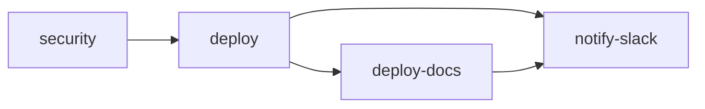

# Alonix IDP Frontend

React web application for the Alonix Intelligent Document Platform (IDP), plus the embedded **Help Center** (`alonix-docs/`) — end-user guides, developer API reference, and interactive playground.

Production readiness: [docs/PRODUCTION_READINESS_TODO.md](../docs/PRODUCTION_READINESS_TODO.md) · [docs/PRODUCTION_STATUS.md](../docs/PRODUCTION_STATUS.md)

---

## Repository layout

```text
alonix-idp-frontend/
├── src/                 # React app (pages, services, stores, components)
├── brands/              # White-label config per product (1glance, findoutai, …)
├── alonix-docs/         # Docusaurus Help Center + API playground (ships at /docs/)
├── scripts/             # Firebase build, merge-docs-into-dist, etc.
├── .github/workflows/   # CI/CD (Firebase Hosting)
└── package.json
```

Related repos:

| Repo | Role | Default local URL |
|------|------|-------------------|
| `alonix-idp-node-backend` | Express API | http://localhost:5005 |
| `alonix-idp-frontend` (this) | React SPA | http://localhost:5173 |
| `alonix-idp-frontend/alonix-docs` | Help Center | http://localhost:3000 |

---

## Tech stack

- React 19 + TypeScript
- Vite 8
- React Router 7
- TanStack Query (server state)
- Zustand (auth/UI state)
- Axios (API client)
- Tailwind CSS 4 + Framer Motion
- Socket.IO client (chat/realtime)
- i18next (internationalization)
- **Docs:** Docusaurus 3, OpenAPI, Scalar playground, Prism mock API

---

## Prerequisites

- **Node.js** ≥ 22.12 (see `engines` in `package.json`)
- **npm** ≥ 10
- **Backend** running from `alonix-idp-node-backend` for real API calls

---

## Brands (white-label)

Each product brand lives under `brands/<slug>/` (`brand.env`, assets, theme). The Vite **mode** selects the brand:

| Brand slug | Display name | Frontend dev | Frontend build |
|------------|--------------|--------------|----------------|
| **1glance** (default) | 1-Glance | `npm run dev` | `npm run build:1glance` |
| **findoutai** | FindoutAI | `npm run dev:findoutai` | `npm run build:findoutai` |

Enterprise builds add `VITE_DEPLOYMENT_PROFILE=enterprise` (hides public signup/pricing). See `brands/README.md`.

**Docs must use the same brand** as the app via `DOCUSAURUS_BRAND=<slug>` so names, logos, and colors match.

---

## Environment variables

### Frontend (`alonix-idp-frontend/.env`)

Copy from `.env.example`:

```bash
cp .env.example .env
```

| Variable | Dev | Production |
|----------|-----|------------|
| `VITE_API_BASE_URL` | Optional — omit to use `/api` via Vite proxy → `localhost:5005` | **Required** — e.g. `https://api.example.com/api` |
| `VITE_DEV_PROXY_TARGET` | Optional — override proxy target (ngrok, remote backend) | — |
| `VITE_SOCKET_URL` | Optional — defaults to API origin | Set if Socket.IO host differs |
| `VITE_SOCKET_PATH` | Optional — default `/socket.io` | Optional |

### Help Center (`alonix-docs/.env`)

```bash
cd alonix-docs && cp .env.example .env
```

| Variable | Purpose | Local dev example |
|----------|---------|-------------------|
| `DOCUSAURUS_BRAND` | Brand slug (`1glance`, `findoutai`) | `1glance` |
| `DOCUSAURUS_SITE_URL` | Canonical site origin | `http://localhost:3000` |
| `DOCUSAURUS_BASE_URL` | URL prefix for docs | `/` locally; `/docs/` on Firebase |
| `DOCUSAURUS_API_MODE` | `mock` or `sandbox` | `mock` (safe default) |
| `DOCUSAURUS_API_SANDBOX_URL` | Real API for playground | `http://localhost:5005/api` |

Full reference: [alonix-docs/.env.example](./alonix-docs/.env.example)

---

## Local development

### Full stack (recommended)

Three terminals — backend, frontend, and docs:

```bash
# Terminal 1 — API
cd ../alonix-idp-node-backend
npm install && cp .env.example .env
npm run dev
# → http://localhost:5005

# Terminal 2 — React app (1-Glance, default brand)
cd ../alonix-idp-frontend
npm install
npm run dev
# → http://localhost:5173

# Terminal 3 — Help Center (match brand)
cd alonix-docs
npm install && cp .env.example .env
npm run dev:1glance
# → http://localhost:3000  (homepage + /docs/... + /api-playground)
```

`npm run dev:1glance` in `alonix-docs` sets `DOCUSAURUS_BRAND=1glance`, syncs brand assets, and starts Prism mock API + Docusaurus.

### Frontend only

```bash
npm install
npm run dev              # 1-Glance (default)
# or
npm run dev:findoutai    # FindoutAI brand
```

Vite dev server: **http://localhost:5173**

API proxy (`vite.config.ts`): `/api` → `http://localhost:5005`. If you see **502** on API calls, start the backend.

### Docs only

```bash
cd alonix-docs
npm run start:1glance    # docs without mock server
# or
npm run dev:1glance      # docs + Prism mock on :4010
```

| URL | Content |
|-----|---------|
| http://localhost:3000 | Help Center homepage |
| http://localhost:3000/docs/... | User & developer guides |
| http://localhost:3000/api-playground | Interactive OpenAPI playground |

### Playground against real API (sandbox)

1. Backend running on `:5005`
2. In `alonix-docs/.env`:

```bash
DOCUSAURUS_BRAND=1glance
DOCUSAURUS_API_MODE=sandbox
DOCUSAURUS_API_SANDBOX_URL=http://localhost:5005/api
```

3. `npm run start:1glance`

Or keep `mock` mode and pick **Sandbox backend** in the playground server dropdown.

---

## Scripts — frontend

| Command | Description |
|---------|-------------|
| `npm run dev` | Dev server, **1-Glance** brand (`vite --mode 1glance`) |
| `npm run dev:1glance` | Same as `dev` |
| `npm run dev:1glance:enterprise` | 1-Glance + enterprise deployment profile |
| `npm run dev:findoutai` | Dev server, FindoutAI brand |
| `npm run dev:findoutai:enterprise` | FindoutAI + enterprise profile |
| `npm run build` | Production build, **1-Glance** (alias for `build:1glance`) |
| `npm run build:1glance` | Typecheck + Vite build, 1-Glance |
| `npm run build:1glance:enterprise` | 1-Glance enterprise build |
| `npm run build:findoutai` | Typecheck + Vite build, FindoutAI |
| `npm run build:findoutai:enterprise` | FindoutAI enterprise build |
| `npm run build:firebase` | App + docs at `/docs/`, merged into `dist/` (see below) |
| `npm run preview` | Preview production `dist/` locally |
| `npm run lint` | ESLint |
| `npm run test` | Vitest (watch) |
| `npm run test:run` | Vitest single run (used in CI) |
| `npm run test:coverage` | Vitest with coverage |
| `npm run qa:deployment` | Deployment-profile unit tests |

---

## Scripts — Help Center (`alonix-docs/`)

| Command | Description |
|---------|-------------|
| `npm run start` | Docusaurus dev server (uses `DOCUSAURUS_BRAND` from `.env`) |
| `npm run start:1glance` | Dev server, 1-Glance brand |
| `npm run dev:mock` | Docs + Prism mock API |
| `npm run dev:1glance` | 1-Glance brand + mock + docs |
| `npm run sync:brand` | Copy `brands/<slug>/` → docs static assets & theme |
| `npm run sync:openapi` | Merge backend OpenAPI into `static/openapi.yaml` |
| `npm run generate:api-docs` | Generate MDX API pages from OpenAPI |
| `npm run build` | Full sync + production static build |
| `npm run build:1glance` | Production build, 1-Glance brand |
| `npm run build:ci` | CI build (brand sync + API docs + Docusaurus) |
| `npm run serve` | Serve `build/` after production build |
| `npm run typecheck` | TypeScript check |

More detail: [alonix-docs/README.md](./alonix-docs/README.md)

---

## Build

### Frontend only

```bash
# 1-Glance (default)
npm run build:1glance

# FindoutAI
npm run build:findoutai
```

Output: `dist/` (SPA only, no docs).

### Help Center only

```bash
cd alonix-docs

# Local paths (no /docs prefix)
DOCUSAURUS_BRAND=1glance npm run build

# Firebase subpath (matches production)
DOCUSAURUS_BRAND=1glance \
DOCUSAURUS_BASE_URL=/docs/ \
DOCUSAURUS_SITE_URL=https://app.yourdomain.com \
npm run build:1glance
```

Output: `alonix-docs/build/`

### App + docs together (Firebase layout)

From **frontend root** — mirrors local parity with CI:

```bash
export VITE_API_BASE_URL=https://api.yourdomain.com/api
export PUBLIC_APP_URL=https://app.yourdomain.com

# Optional: override brand (default 1glance)
export VITE_BRAND_MODE=1glance
export DOCUSAURUS_BRAND=1glance

npm run build:firebase
```

This will:

1. `npm run build:<brand>` → `dist/`
2. Build docs with `DOCUSAURUS_BASE_URL=/docs/` → `alonix-docs/build/`
3. Merge docs into `dist/docs/` via `scripts/merge-docs-into-dist.sh`

Preview:

```bash
npx serve dist
# App:  http://localhost:3000/
# Docs: http://localhost:3000/docs/
```

---

## CI/CD — Firebase Hosting

Workflow: [`.github/workflows/firebase-hosting.yml`](./.github/workflows/firebase-hosting.yml)

**Triggers:** push to `develop`, or `workflow_dispatch` (manual).

### Pipeline jobs



| Job | What it does |
|-----|----------------|
| **security** | Gitleaks secret scan, `npm run test:run`, `npm audit --omit=dev --audit-level=high` |
| **deploy** | Build Help Center → build React app → merge `alonix-docs/build` into `dist/docs/` → Firebase deploy |
| **deploy-docs** | Smoke test live `/docs/`, `/docs/introduction/product-overview/`, `/docs/api-playground/`, `/docs/openapi.yaml` |
| **notify-slack** | Slack webhook on success/failure (skipped if `SLACK_WEBHOOK_URL` unset) |

**Live URLs after deploy:**

- App: `https://<FIREBASE_HOSTING_SITE>.web.app`
- Docs: `https://<FIREBASE_HOSTING_SITE>.web.app/docs/`

### GitHub configuration

**Secrets** (repository → Settings → Secrets):

| Secret | Required | Purpose |
|--------|----------|---------|
| `VITE_API_BASE_URL` | Yes | Production API base written to `.env.production` |
| `FIREBASE_PROJECT_ID` | Yes | Firebase project |
| `FIREBASE_HOSTING_SITE` | Yes | Hosting site ID |
| `FIREBASE_SERVICE_ACCOUNT` | Yes | JSON service account for deploy |
| `SLACK_WEBHOOK_URL` | No | Deploy notifications |

**Variables** (repository → Settings → Variables):

| Variable | Purpose |
|----------|---------|
| `PUBLIC_APP_URL` | Canonical app URL for Docusaurus `DOCUSAURUS_SITE_URL` and docs smoke tests (e.g. `https://app.yourdomain.com`). Falls back to `https://<FIREBASE_HOSTING_SITE>.web.app` if unset. |

### CI build settings (current workflow)

The workflow currently builds:

| Artifact | Brand / settings |
|----------|------------------|
| React app | `npm run build:findoutai` + `VITE_API_BASE_URL` secret |
| Help Center | `DOCUSAURUS_BRAND=findoutai`, `DOCUSAURUS_BASE_URL=/docs/`, `DOCUSAURUS_API_MODE=mock` |

To deploy **1-Glance** instead, update the workflow env blocks to `build:1glance` and `DOCUSAURUS_BRAND: 1glance`, or pass `DOCUSAURUS_BRAND` / brand via GitHub vars.

### Manual deploy

```bash
# From Actions tab → "Deploy to Firebase Hosting" → Run workflow
```

Ensure `alonix-docs/` is committed in the same repo (CI verifies `alonix-docs/package.json` exists).

---

## App areas

- **Public:** landing, login, signup, email verification, forgot/reset password
- **Private:** dashboard, documents, chat, profile
- **RBAC-protected:** users, groups, org settings, activity logs, connectors, billing (SaaS)

Route protection: private route guard + `RoleProtectedRoute` (capabilities from backend).

---

## Project structure

```text
src/
  brand/         useBrand(), theme tokens (synced from brands/<slug>/)
  components/    reusable UI and domain components
  pages/         route-level pages
  services/      API clients (authApi, chatApi, …)
  stores/        Zustand stores
  hooks/         React Query hooks, RBAC helpers
  layout/        app shell, sidebar, top nav
  i18n/          translations

alonix-docs/
  docs/          Markdown/MDX — user guides, tutorials, API reference
  src/           Docusaurus pages, playground components
  static/        openapi.yaml, brand assets, playground HTML
  scripts/       sync-brand, sync-openapi, generate-api-docs, Prism mock

brands/
  1glance/       brand.env, assets/, theme.css
  findoutai/     brand.env, assets/, theme.css
```

---

## Troubleshooting

| Issue | Fix |
|-------|-----|
| API 502 in dev | Start `alonix-idp-node-backend` on port 5005 |
| Docs show `{{brandName}}` in sidebar | Run `npm run sync:brand`; restart docs; ensure `parseFrontMatter` in `docusaurus.config.ts` |
| `process is not defined` on docs homepage | Use `useSitePath()` hook (fixed in `src/utils/sitePath.ts`) |
| Prism mock fails on start | Run `npm run sync:openapi` in `alonix-docs` |
| CI fails "alonix-docs missing" | Commit `alonix-docs/` inside this repo |

---

## Further reading

- [brands/README.md](./brands/README.md) — add a new white-label brand
- [alonix-docs/README.md](./alonix-docs/README.md) — docs-only deep dive (playground, OpenAPI sync)
- [alonix-idp-node-backend/README.md](../alonix-idp-node-backend/README.md) — API setup
