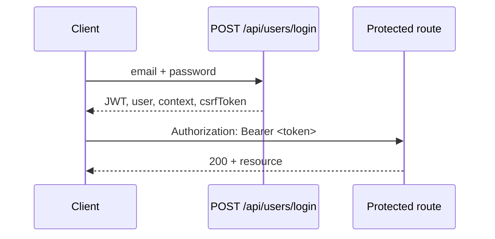

# Authentication

{{brandName}} IDP uses **JWT Bearer authentication** with optional **httpOnly cookies** and **CSRF protection** for browser clients.

## Login flow



## Obtain a token

**Production route:** `POST /api/users/login`

**Documentation alias (mock only):** `POST /api/auth/login`

### Request

```json
{
  "email": "demo.admin@alonix.example",
  "password": "DemoPass123!"
}
```

### Success response (200)

```json
{
  "message": "Login successful",
  "token": "<jwt-from-login-response>",
  "user": {
    "_id": "66f1abcd1234567890ef1234",
    "email": "demo.admin@alonix.example",
    "name": "Demo Admin",
    "orgId": "507f1f77bcf86cd799439011"
  },
  "context": {
    "orgId": "507f1f77bcf86cd799439011",
    "orgRole": "COMPANY_ADMIN",
    "activeGroupId": "507f1f77bcf86cd799439012"
  },
  "csrfToken": "csrf_token_value"
}
```

:::warning Cookie vs Bearer
The Express backend sets an httpOnly `auth` cookie on login. SPA clients (`alonix-idp-frontend`) rely on cookies + CSRF for mutating requests. API integrations should send **`Authorization: Bearer <token>`** explicitly.
:::

## Use the token

Add the header on every protected request:

```http
Authorization: Bearer <jwt-from-login-response>
```

In the [API Playground](/api-playground), click **Authorize** and enter:

```text
Bearer <paste-token-here>
```

## Workspace scoping

Many routes require the active workspace (group). Send:

```http
X-Group-Id: 507f1f77bcf86cd799439012
```

Or pass `groupId` in the request body/query where documented.

## CSRF (browser clients)

For `POST`, `PUT`, `PATCH`, `DELETE` from the browser SPA:

1. Read `csrfToken` from the login response (or `GET /users/me/context`)
2. Send header `X-CSRF-Token: <csrfToken>`
3. Ensure cookies are included (`credentials: 'include'` in fetch)

Server-to-server API clients using Bearer tokens only typically do not need CSRF.

## Token lifetime

JWT expiry is configured via `JWT_EXPIRES_IN` in the backend `.env` (default varies by deployment). When a token expires, you receive **401** with `code: TOKEN_EXPIRED` — re-authenticate via login.

## Current user endpoints

| Endpoint | Purpose |
|----------|---------|
| `GET /api/users/me` | Composite profile + context (docs/mock convenience) |
| `GET /api/users/me/context` | Production RBAC context refresh |

See [GET /users/me/context](/docs/developer/api-reference/users/get-users-me-context) for the production context endpoint.

## API Playground

1. Start docs with mock API: `npm run dev:mock` (Prism on port **4010**).
2. Open [API Playground](/api-playground) or any endpoint’s **Open in API Playground** button.
3. Call **POST /users/login** with the example credentials from the request body schema.
4. Copy the `token` from the response → click **Authorize** → paste the token (Scalar adds the `Bearer` prefix).
5. Protected routes (e.g. `GET /users/me/context`) will then send the JWT automatically.

The playground persists your bearer token in browser `localStorage` between visits.

## Security checklist

- Never commit tokens or `.env` files
- Use **mock mode** for public demos
- Use **sandbox** only with non-production data
- Rotate credentials if accidentally exposed in the playground
