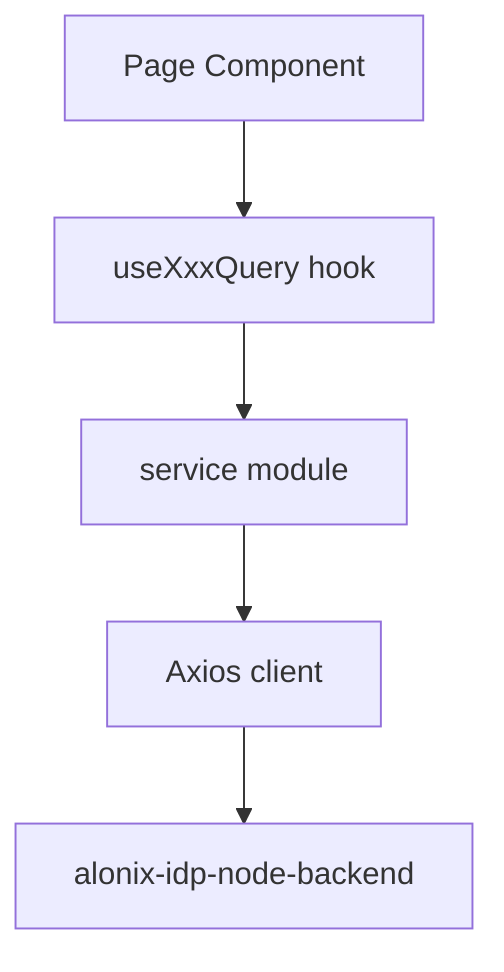

# Frontend Architecture

High-level structure of `alonix-idp-frontend`.

## Directory layout

```text
src/
├── App.tsx                 # Routes, providers
├── layout/                 # Sidebar, TopNavBar
├── pages/                  # Route-level screens
│   ├── auth/               # Login, signup, reset password
│   ├── chat/               # RAG chat UI
│   ├── documents/          # Vault, pipeline, connectors
│   ├── groups/             # Workspace management
│   ├── users/              # User management
│   └── admin/              # Org settings (via components)
├── components/             # Shared UI
├── services/               # API clients
├── hooks/                  # React Query hooks, RBAC
├── stores/                 # Zustand (authStore)
├── types/                  # TypeScript types
└── i18n/                   # Translations
```

## Routing

`App.tsx` defines protected routes behind session checks. RBAC gates admin-only paths via `useRbac` and server-provided `context.capabilities`.

## Data fetching pattern



Example: documents list uses `useDocumentQueries` → `documentReviewApi` / pipeline hooks → `/api/documents/*`.

## Auth store

`stores/authStore.ts` holds:

- `user` — profile from login
- `context` — org role, groups, capabilities
- Session persistence across reload via `authApi.fetchSession()`

## Error handling

Axios interceptors in `services/api/client.ts` normalize API errors. UI surfaces `message` from backend JSON. See [Error handling](../error-handling).

## Branding

`src/brand/` contains theme tokens and `brandConfig.ts` for multi-brand builds (1Glance, Findout AI, enterprise).

## Adding a new frontend feature

1. Add API method in `services/`
2. Add React Query hook in `hooks/queries/` if cached server state
3. Build page under `pages/`
4. Register route in `App.tsx`
5. Document new backend endpoints in this portal (`npm run sync:openapi`)
