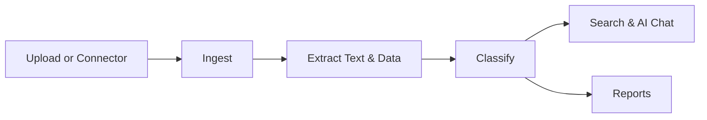

# What Is {{brandName}}?

## Overview

{{brandName}} is an **Intelligent Document Platform (IDP)** that helps organizations store, process, search, and understand their documents in one secure place. You upload files (or connect external sources), {{brandName}} ingests and extracts their content, and you can search, chat with AI, and generate reports—all within organized **workspaces** (called **Groups** in the product).

Whether you manage contracts, invoices, HR records, or customer correspondence, {{brandName}} turns static files into searchable, actionable knowledge.

## Purpose

{{brandName}} exists to solve a common problem: important information is trapped inside PDFs, scans, emails, and shared drives. Teams waste time hunting for files and re-reading the same documents. {{brandName}} centralizes documents, applies AI to extract and classify content, and lets you ask questions in plain language—with answers backed by citations from your actual files.

## Prerequisites

No technical background is required to use {{brandName}}. You need:

- A supported web browser (see [System Requirements](/docs/getting-started/system-requirements))
- An email address to create an account or accept an invitation
- Access granted by your organization (invite or self-signup, depending on your company's setup)

## Step-by-Step Instructions

### 1. Understand the core concepts

| Concept | What it means in {{brandName}} |
|---------|-------------------------|
| **Organization** | Your company account. One org can have many workspaces. |
| **Group / Workspace** | A dedicated area for a team, project, or department. Documents and users belong to a workspace. |
| **Document** | Any file you upload or ingest via a connector (PDF, Word, images, etc.). |
| **Pipeline** | The automated flow: upload → ingest → extract → classify. |
| **AI Chat** | Ask questions about your documents; answers include citations. |
| **Connector** | Automated intake from Email, SFTP, or SharePoint. |

### 2. See how a document moves through {{brandName}}

### 3. Know your role

{{brandName}} uses role-based access:

- **Company Admin** — manages the whole organization, billing (SaaS), and org-wide settings.
- **Group Admin** — manages a specific workspace: users, documents, connectors, and settings.
- **Search User** — searches, views documents, uses AI Chat, and downloads reports within assigned workspaces.

Learn more in [Users and Roles](/docs/user-guide/users-and-roles).

### 4. Sign in and pick a workspace

After logging in, use the **workspace switcher** in the top navigation to choose which Group you are working in. Everything you do—uploads, chat, reports—is scoped to the active workspace.

[Screenshot – {{brandName}} home screen with workspace switcher highlighted in the top navigation bar]

## Expected Results

After reading this guide, you should understand:

- What {{brandName}} does and who it is for
- How documents flow from upload to AI-powered search
- The difference between an organization, workspace, and document
- Which role you likely have and what you can do

## Tips

:::tip Start with one workspace
If you are new, focus on a single workspace until you are comfortable with uploads and AI Chat. Add more workspaces as your team grows.
:::

- Use the [Dashboard](/docs/user-guide/dashboard) as your daily starting point for activity and quick actions.
- Bookmark the [Glossary](/docs/glossary/terms) if you encounter unfamiliar terms.

## Best Practices

- Keep workspaces aligned with real teams or projects (e.g., "Finance Q4", "Legal Contracts").
- Upload a few representative documents first to test search and AI Chat before bulk importing.
- Ask your **Group Admin** which connectors (Email, SFTP, SharePoint) are already configured for your team.

## Common Mistakes

- **Confusing Groups with users** — A Group is a workspace, not a person. Users are invited *into* Groups.
- **Expecting instant AI answers on empty workspaces** — AI Chat needs ingested documents to cite. Upload or connect sources first.
- **Working in the wrong workspace** — Always check the workspace switcher before uploading or chatting.

## Troubleshooting

| Issue | What to do |
|-------|------------|
| Cannot see any workspaces | Ask your Company Admin or Group Admin for an invitation. |
| Features missing (e.g., Billing, Org Settings) | Your role may not include those permissions. See [Users and Roles](/docs/user-guide/users-and-roles). |
| Documents not appearing in search | Wait for pipeline processing to finish. See [Document Pipeline](/docs/user-guide/document-pipeline). |

## Related Articles

- [Who Should Use {{brandName}}?](/docs/introduction/who-should-use-alonix)
- [Creating Your Account](/docs/getting-started/creating-account)
- [UI Overview](/docs/getting-started/ui-overview)
- [Your First Workspace](/docs/getting-started/your-first-workspace)
- [Glossary](/docs/glossary/terms)
