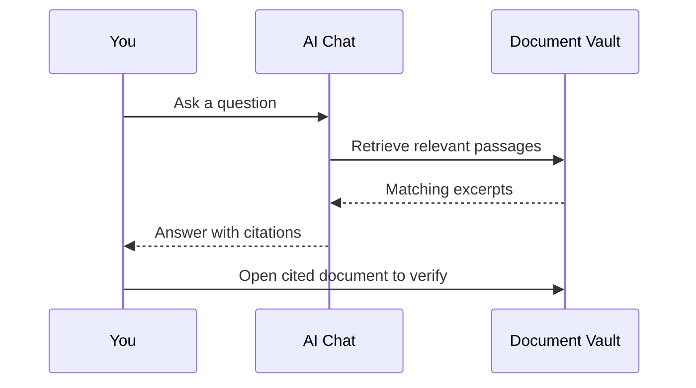

# AI Chat

## Overview

**AI Chat** lets you ask questions in plain English about documents in your active workspace. {{brandName}} uses retrieval-augmented generation (RAG) to ground answers in your actual files and shows **citations** so you can verify every claim.

## Purpose

Replace manual document hunting with conversational search—ideal for policy lookup, contract terms, invoice details, and cross-document summaries.

## Prerequisites

- Workspace with processed documents — [Document Pipeline](/docs/user-guide/document-pipeline)
- Correct workspace selected — [Workspace Switcher](/docs/user-guide/workspace-switcher)
- **Search User** or higher role

## Step-by-Step Instructions

### 1. Open AI Chat

1. Confirm your workspace in the top navigation.
2. Click **AI Chat** in the sidebar.
3. The chat panel opens with a message input at the bottom.

[Screenshot – AI Chat interface with question input and citation panel]

### 2. Ask a question

1. Type a specific question (e.g., "What payment terms apply to Vendor X in 2024 contracts?").
2. Press **Enter** or click **Send**.
3. Wait for the response—retrieval may take a few seconds.

### 3. Review citations

1. Read the AI response.
2. Click **citation links** or source chips to open the referenced document.
3. Verify critical facts in the original file before acting on them.

### 4. Continue the conversation

Follow-up questions stay in context within the session. For a new topic, start a **new chat** if the UI provides that option.

### 5. Know the limits

AI Chat answers from documents in the **current workspace only**. It does not access other Groups, the public internet, or unprocessed uploads.

## Expected Results

- Relevant answers drawn from your documents.
- One or more citations per factual claim when source material exists.
- Clear message when no supporting documents are found.
- Ability to open cited documents directly from the chat.

## Tips

:::tip Ask like you would ask a colleague
Specific questions ("What is the renewal date in the Acme MSA?") outperform vague ones ("Tell me about contracts").
:::

- Include entity names, dates, and document types in your question.
- If citations are weak, upload missing documents or fix pipeline failures first.

## Best Practices

- Treat AI output as a **draft**—verify citations for legal, financial, or compliance decisions.
- Do not paste highly sensitive data into chat unless approved by your security team.
- See [Security and Sensitivity](/docs/best-practices/security-sensitivity) for data handling rules.

## Common Mistakes

- Chatting in an empty or wrong workspace.
- Ignoring citations and relying on uncited generalizations.
- Asking about documents still in **Processing** status.

## Troubleshooting

| Issue | Solution |
|-------|----------|
| "No relevant documents" | Broaden question; confirm files are Ready. |
| Wrong answer | Check citations; file may be ambiguous or outdated. |
| Slow responses | Large vault or peak load—retry shortly. |
| No AI Chat menu item | Role or plan restriction—contact admin. |

Full guide: [AI Chat Problems](/docs/troubleshooting/ai-chat-problems).

## Related Articles

- [Ask AI Tutorial](/docs/tutorials/ask-ai)
- [Documents](/docs/user-guide/documents)
- [Document Pipeline](/docs/user-guide/document-pipeline)
- [Reports](/docs/user-guide/reports)
