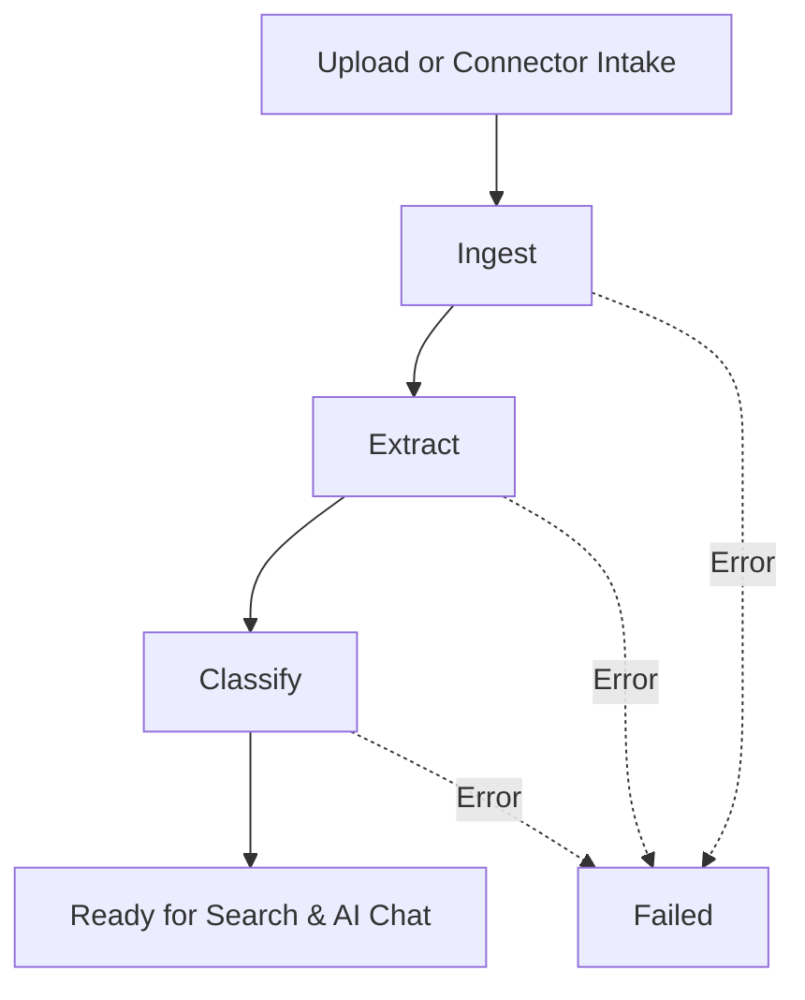

# Document Pipeline

## Overview

Every document in Alonix passes through an automated **pipeline** after upload or connector intake. The pipeline makes files searchable, enriches them with extracted text and metadata, and assigns classifications used by search, reports, and AI Chat.

## Purpose

Help you interpret status labels, estimate processing time, and resolve failures so your document vault stays complete and trustworthy.

## Prerequisites

- At least one document uploaded — [Your First Document](/docs/getting-started/your-first-document)
- Access to **Documents** and **Dashboard**

## Step-by-Step Instructions

### 1. Understand pipeline stages

| Stage | What happens |
|-------|----------------|
| **Upload** | File transferred to Alonix storage |
| **Ingest** | File registered, virus scan and validation (if enabled) |
| **Extract** | Text, tables, and metadata pulled (OCR for scans) |
| **Classify** | Document type, tags, or categories assigned |
| **Ready** | Available for search, reports, and AI Chat citations |

### 2. Monitor status in Documents

1. Open **Documents**.
2. Locate the **Status** column on each row.
3. Common values: `Queued`, `Processing`, `Complete`, `Failed`.

[Screenshot – Document list showing different pipeline statuses with color indicators]

### 3. Monitor status on Dashboard

The Dashboard summarizes counts of processing and failed documents for quick triage.

### 4. Handle failed documents

1. Click the failed document.
2. Read the error detail (unsupported format, corrupt file, password-protected PDF, etc.).
3. Fix the source file or convert format.
4. Re-upload or trigger reprocess (if available).

### 5. Confirm readiness for AI Chat

AI Chat cites only documents that reached **Ready** state with successful extraction. If answers lack citations, verify pipeline completion first.

## Expected Results

- Clear progression from upload to ready state for supported file types.
- Extracted text visible in document preview.
- Classification tags applied per workspace rules.
- Failed items show actionable error messages.

## Tips

:::tip Batch uploads
Large batches queue sequentially. Dashboard "Processing" count may stay elevated for minutes—not necessarily an error.
:::

- Text-based PDFs process faster than image-only scans.
- Connector-ingested files follow the same pipeline as manual uploads.

## Best Practices

- Standardize on supported formats (PDF, DOCX, common images) before bulk migration.
- Resolve failures within SLA windows so search gaps do not affect compliance reviews.
- Log recurring failure patterns for IT (e.g., specific encrypted PDF supplier).

## Common Mistakes

- Reporting "search broken" while documents are still **Processing**.
- Uploading password-protected files without providing passwords.
- Expecting classification perfection on day one—review and tune over time with admins.

## Troubleshooting

| Symptom | Likely cause | Action |
|---------|--------------|--------|
| Stuck Processing | Large file or OCR backlog | Wait; contact admin if >30 min |
| Failed Extract | Corrupt or unsupported file | Re-export PDF; re-upload |
| Empty extraction | Scan quality poor | Rescan at higher DPI |
| Wrong classification | Model uncertainty | Admin retag; improve training data |

## Related Articles

- [Documents](/docs/user-guide/documents)
- [Dashboard](/docs/user-guide/dashboard)
- [Upload Problems](/docs/troubleshooting/upload-problems)
- [Connector Ingest Tutorial](/docs/tutorials/connector-ingest)
